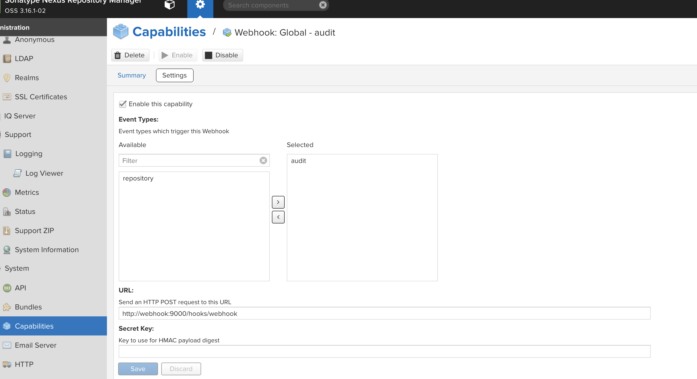
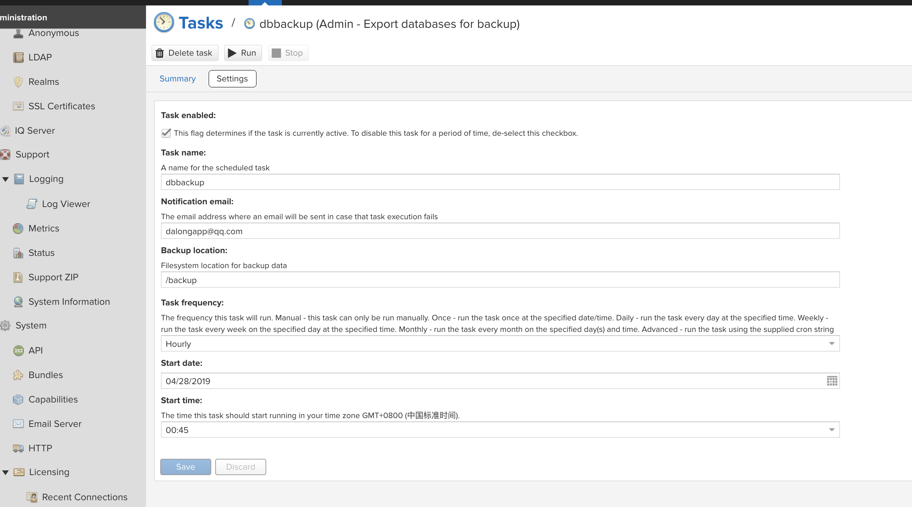

# nexus dbbackup with webhook

use almir/webhook

## how to config

* add webhook capabilities

> type with audit



* config db exporter



* do some db exporter

click the run button

* some message

```code
webhook_1  | [webhook] 2019/04/28 11:39:33 [4f8200] webhook hook triggered successfully
webhook_1  | [webhook] 2019/04/28 11:39:33 [4f8200] error extracting command arguments: couldn't retrieve argument for {Source:payload Name: EnvName: Base64Decode:false}
webhook_1  | [webhook] 2019/04/28 11:39:33 [4f8200] error extracting command arguments: couldn't retrieve argument for {Source:payload Name: EnvName: Base64Decode:false}
webhook_1  | [webhook] 2019/04/28 11:39:33 [4f8200] executing /app.sh (/app.sh) with arguments ["/app.sh" "" ""] and environment [] using / as cwd
webhook_1  | [webhook] 2019/04/28 11:39:33 [4f8200] command output: this is a  demo app
webhook_1  | 
webhook_1  | [webhook] 2019/04/28 11:39:33 [4f8200] finished handling webhook
webhook_1  | [webhook] 2019/04/28 11:39:33 200 | 2.781886ms | webhook:9000 | POST /hooks/webhook 
webhook_1  | [webhook] 2019/04/28 11:40:00 [778ccc] incoming HTTP request from 172.19.0.3:57986
webhook_1  | [webhook] 2019/04/28 11:40:00 [778ccc] webhook got matched
webhook_1  | [webhook] 2019/04/28 11:40:00 [778ccc] webhook got matched, but didn't get triggered because the trigger rules were not satisfied
webhook_1  | [webhook] 2019/04/28 11:40:00 200 | 201.265µs | webhook:9000 | POST /hooks/webhook 
webhook_1  | [webhook] 2019/04/28 11:40:00 200 | 152.797µs | webhook:9000 | POST /hooks/webhook 
webhook_1  | [webhook] 2019/04/28 11:40:00 200 | 147.935µs | webhook:9000 | POST /hooks/webhook 
webhook_1  | [webhook] 2019/04/28 11:40:00 [ca1ac1] incoming HTTP request from 172.19.0.3:57988
webhook_1  | [webhook] 2019/04/28 11:40:00 [ca1ac1] webhook got matched
webhook_1  | [webhook] 2019/04/28 11:40:00 [ca1ac1] webhook got matched, but didn't get triggered because the trigger rules were not satisfied
webhook_1  | [webh
```